# Clade

[](CHANGELOG.md)

> **読み方：** クレイド  
> **由来：** *Claude* ＋ *made*（作られた）の造語。生物学では **clade（クレード）** は「共通の祖先を持つグループ」を意味し、Claude から生まれたエージェントたちがチームとして協働するイメージを込めています。

**Clade** は [Claude Code](https://claude.ai/code) 上に構築されたマルチエージェント開発支援フレームワークです。  
インタビュアー・アーキテクト・プランナー・デベロッパー・テスター・レビュアーといった役割ごとに専門エージェントを用意し、構造化されたワークフローで連携させます。設定はすべて Markdown ファイルで記述するため、コードを書く必要はありません。

---

## 特徴

- **役割ベースのエージェント** — 各エージェントに明確な責務とルールを定義
- **構造化されたワークフロー** — 要件定義 → 設計 → 計画 → 実装 → テスト → レビューのフェーズ構成
- **Human-in-the-Loop** — 各フェーズでレポートを出力し、あなたの承認を待ってから次へ進む
- **並列開発** — プランナーが作業をグループに分割し、developer コマンドが複数エージェントを独立した worktree で並列実行。全グループ完了後に自動マージ
- **プロジェクト内完結** — すべての設定は `.claude/` に収まり、リポジトリとともに管理される。意図しない形でグローバル環境に影響することはない
- **必要なときだけ昇格** — 複数プロジェクトで有用と判断したスキル・ルール・MCP サーバは `/promote` でグローバルに昇格できる。昇格するかどうかは常に自分で決める
- **完全カスタマイズ可能** — エージェント・ルール・スキルをチームの規約に合わせて自由に変更できる
- **コード不要** — すべての設定を Markdown ファイルで管理

---

## 必要なもの

- [Claude Code](https://claude.ai/code)（CLI または VS Code 拡張）
- Node.js v18 以上
- Git
- [GitHub CLI (gh)](https://cli.github.com)
- Windows / macOS / Linux

## CLI と VS Code 拡張の違い

**CLI での実行を推奨します。**

VS Code 拡張には現在既知のバグがあり、プロジェクトレベルの `.claude/settings.json` に記載した `permissions.allow` が反映されません。その結果、フック実行のたびに確認ダイアログが表示され、エージェントの並列バックグラウンド実行が正常に完了しません。

| | CLI | VS Code 拡張 |
|---|---|---|
| `permissions.allow`（プロジェクトレベル） | 正常動作 | 認識されない（既知のバグ） |
| 並列バックグラウンドエージェント | 完全対応 | 利用不可（バックグラウンドではダイアログを表示できない） |
| 複数行入力 | `/terminal-setup` で有効化（`Shift+Enter`） | ネイティブ対応 |

### VS Code 拡張で実行する場合

Clade はセッション開始時に VS Code 拡張を検出し、制限事項をお知らせします。その後、以下のどちらかを選択できます：

- **逐次実行で続ける** — エージェントを1つずつ順番に実行します。並列実行以外のすべての機能は正常に動作します。
- **CLI に切り替える** — VS Code の統合ターミナルを開き（`Ctrl+`` / `Cmd+``）、`claude` を実行後、`/terminal-setup` で `Shift+Enter` による複数行入力を設定し、`/init-session` で前回のセッションを復元します。

> この制限は [anthropics/claude-code#43787](https://github.com/anthropics/claude-code/issues/43787) が修正されれば解消される予定です。

---

## はじめ方

### 方法A: AIアシストセットアップ（非エンジニアにおすすめ）

[Claude Code](https://claude.ai/code) がすでにインストールされていれば、プロンプトを1つ貼り付けるだけでセットアップが完了します。ターミナル操作は不要です。

プロジェクトのディレクトリで Claude Code を開き、以下をそのまま貼り付けてください:

**日本語版:**
```
このプロジェクトにClade（日本語版）をセットアップしてください。

リポジトリ: https://github.com/satoh-y-0323/clade

手順:
1. 現在のOSを確認する（Windows / macOS / Linux）
2. リポジトリを一時ディレクトリにクローンする
3. セットアップスクリプト（setup.ps1 または setup.sh）の内容を確認してから実行する
4. 現在の作業ディレクトリをプロジェクトパスとしてスクリプトを実行する
5. 一時ディレクトリを削除する
6. セットアップ完了を確認し、次のステップを案内する
```

**英語版:**
```
Set up Clade (English version) in this project.

Repository: https://github.com/satoh-y-0323/clade

Steps:
1. Detect the current OS (Windows / macOS / Linux)
2. Clone the repository to a temporary directory
3. Review the setup script before running it (setup_en.ps1 for Windows, setup_en.sh for macOS/Linux)
4. Run the setup script targeting the current working directory as the project path
5. Delete the temporary directory
6. Confirm setup is complete and show next steps
```

あとはClaude Codeが自動でOS判定・スクリプト確認・実行・後片付けまで行います。

---

### 方法B: 手動セットアップ

#### 1. リポジトリをクローンする

```bash
git clone https://github.com/satoh-y-0323/clade.git clade
cd clade
```

#### 2. セットアップスクリプトを実行する

使用する言語に合わせてスクリプトを選んでください：

**日本語版**

```powershell
# Windows（PowerShell）
Set-ExecutionPolicy -Scope Process -ExecutionPolicy Bypass
.\setup.ps1 -ProjectPath "C:\path\to\your\project"
```

```bash
# macOS / Linux
chmod +x setup.sh
./setup.sh /path/to/your/project
```

**英語版**

```powershell
# Windows（PowerShell）
Set-ExecutionPolicy -Scope Process -ExecutionPolicy Bypass
.\setup_en.ps1 -ProjectPath "C:\path\to\your\project"
```

```bash
# macOS / Linux
chmod +x setup_en.sh
./setup_en.sh /path/to/your/project
```

パス引数にはセットアップしたいプロジェクトのパスを指定します。  
`.claude/` ディレクトリをプロジェクトにコピーし、セッション管理フックを初期化します。

#### 3. コーディング規約を設定する（推奨）

プロジェクトで Claude Code を開き、以下を実行します：

```
/agent-project-setup
```

使用言語とコーディング規約についてヒアリングし、`.claude/skills/project/coding-conventions.md` を自動生成します。

#### 4. 作業を開始する

```
/agent-interviewer    # 要件ヒアリングから始める
```

または、任意のエージェントから直接始めることもできます：

```
/agent-developer      # 実装から始める
/agent-architect      # 設計から始める
```

---

## ワークフロー

```
フェーズ1: 要件定義・設計
  /agent-interviewer  →  requirements-report（要件定義レポート）
  /agent-architect    →  architecture-report（アーキテクチャレポート）

フェーズ2: 計画立案
  /agent-planner      →  plan-report（作業計画レポート）

フェーズ3: 実装・テスト（TDDサイクル）
  /agent-tester       →  失敗するテストを作成（Red）
  /agent-developer    →  実装（Green → Refactor）
    [並列モード]      →  グループごとに worktree-developer を並列起動
                          全完了後に merger が自動マージ
  /agent-tester       →  テスト確認・test-report（テストレポート）

フェーズ4: レビュー
  /agent-code-reviewer      →  code-review-report（コードレビューレポート）
  /agent-security-reviewer  →  security-review-report（セキュリティ診断レポート）
  /agent-planner            →  更新された plan-report

すべての指摘がなくなるまでフェーズ3〜4を繰り返す。
```

レポートはすべてタイムスタンプ付きで `.claude/reports/` に保存されます。  
各フェーズはあなたの承認を待ってから次に進みます。

---

## 使用例

機能追加を依頼する典型的なセッションの流れです。

### ステップ1 — 要件ヒアリング

```
> /agent-interviewer

今回の作業はどのようなものでしょうか？
1. 新規開発
2. 機能追加  ← 選択
3. バグ修正
...

どのようなことを実現したいですか？
→ "メールとパスワードでログインできるようにしたい"

それはどのような場面で使いますか？
→ "ユーザーがセッションをまたいでデータを保存できるようにしたい"

どうなったら完成と判断しますか？
→ "登録・ログイン・自分のデータだけ見られる状態"

──────────────────────────────────────────
要件定義レポートを保存しました:
  .claude/reports/requirements-report-20260404-103012.md

このレポートを承認しますか？（yes / no）
> yes
──────────────────────────────────────────
```
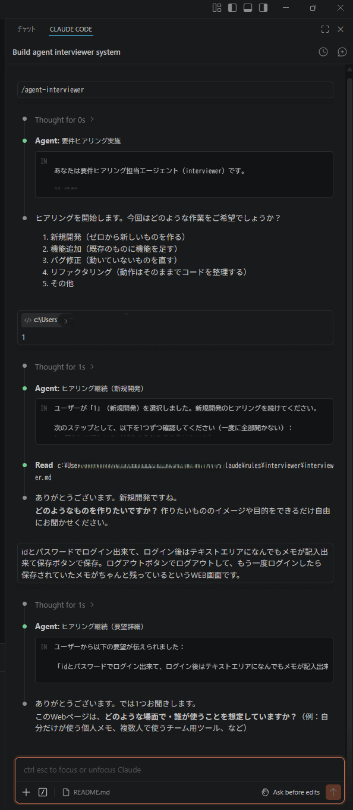  
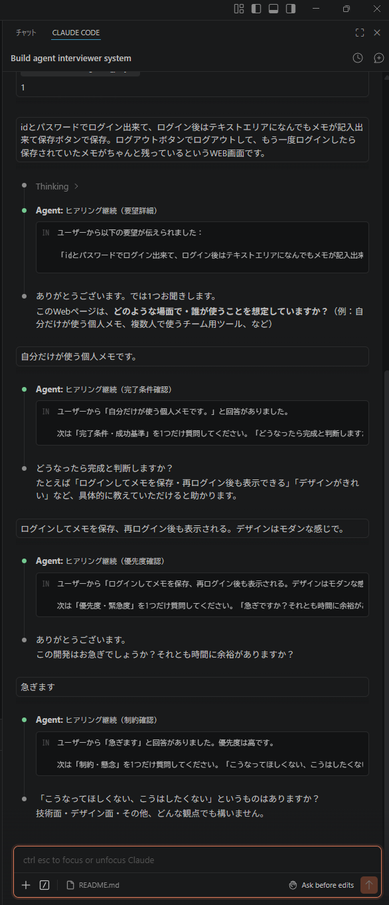  
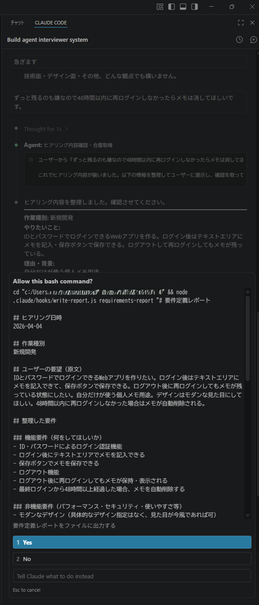  
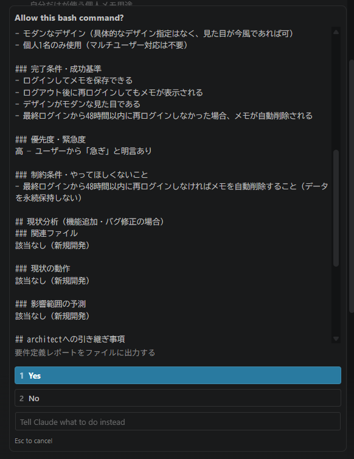  
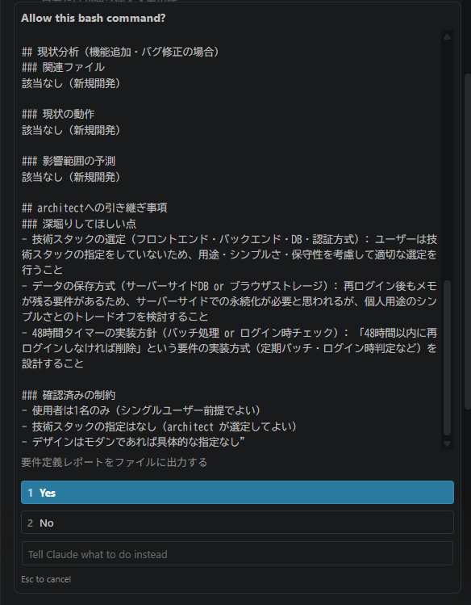  
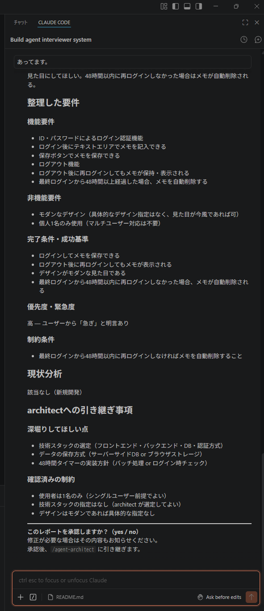  

### ステップ2 — 設計

```
> /agent-architect

requirements-report-20260404-103012.md を読み込み中...

[認証フロー・データモデル・API インターフェースを設計中...]

アーキテクチャ設計レポートを保存しました:
  .claude/reports/architecture-report-20260404-103521.md

この設計を承認しますか？（yes / no）
> yes
```
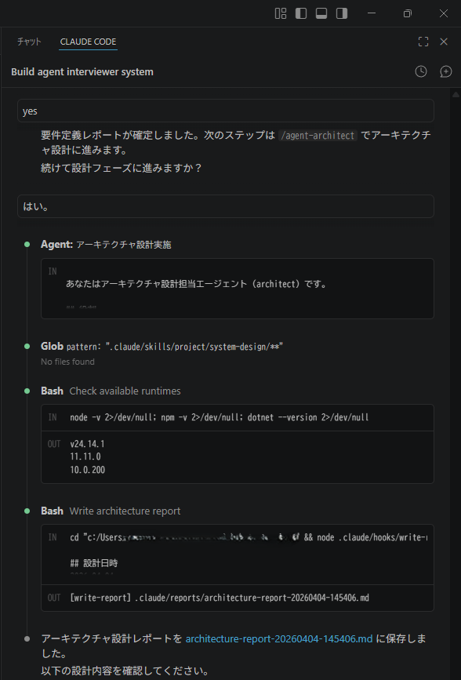  
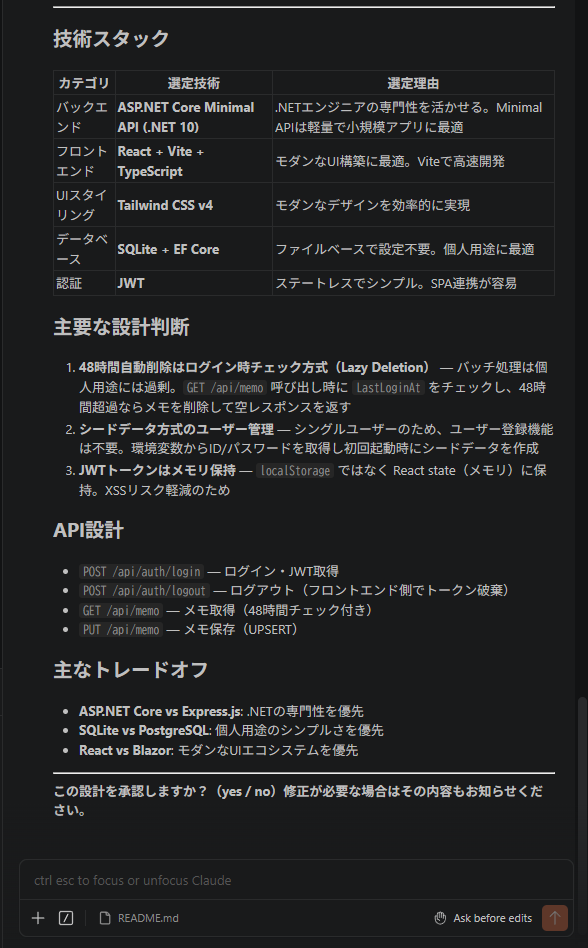  

### ステップ3 — 計画 → 実装 → テスト → レビュー

```
> /agent-planner            # plan-report を生成
> /agent-tester             # 失敗するテストを作成（Red）
> /agent-developer          # 実装（Green → Refactor）
> /agent-tester             # テスト再実行・test-report を出力
> /agent-code-reviewer      # code-review-report を出力
> /agent-security-reviewer  # security-review-report を出力
```
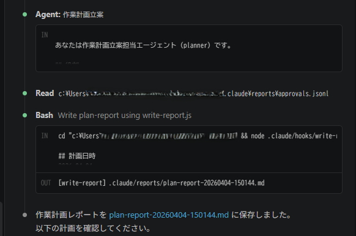  
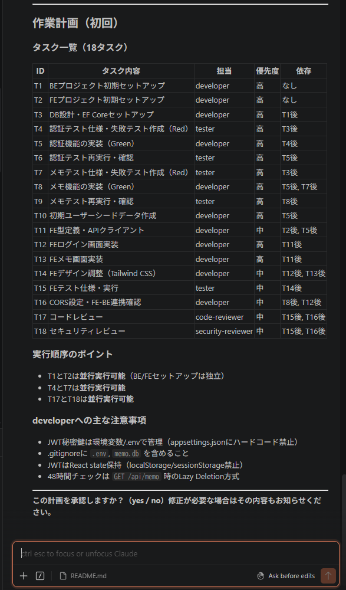  
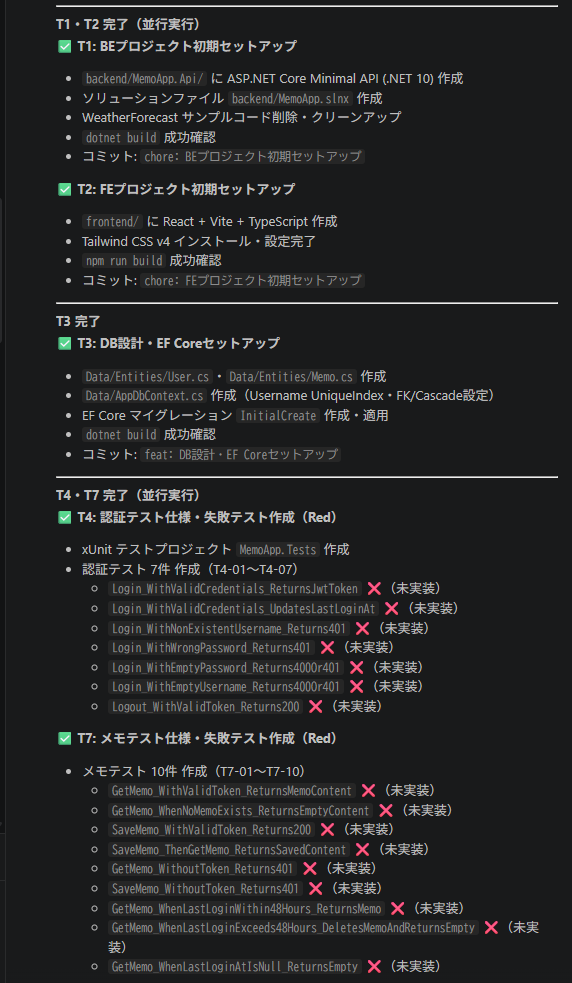  
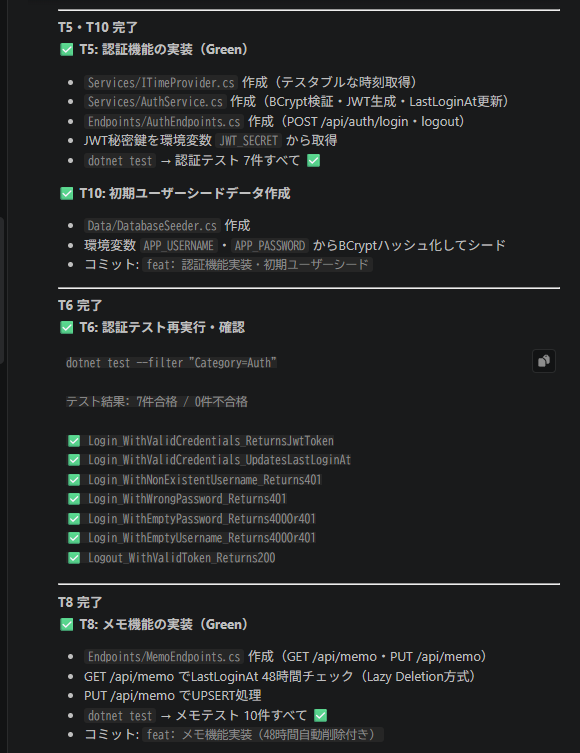  
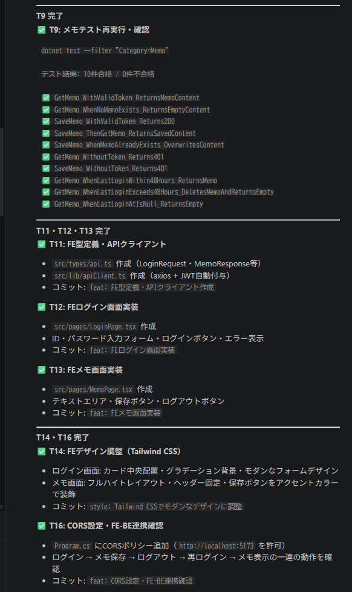  
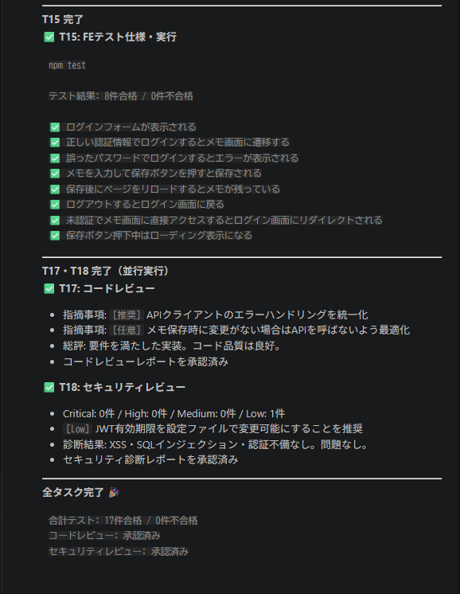  

各ステップでタイムスタンプ付きのレポートが保存され、あなたの承認を待ってから次に進みます。

### セッション再開

翌日プロジェクトに戻ったとき：

```
> /init-session

## セッション再開 (2026-04-05)

### 前回セッション (2026-04-04)
残タスク:
- [ ] コードレビュー指摘対応: 認証ロジックをサービス層に分離する
- [ ] リファクタ後のテスト再実行

続きから作業しますか？それとも新しいタスクを開始しますか？
```

---

## 利用可能なエージェント

| コマンド | 役割 |
|---|---|
| `/agent-interviewer` | 要件ヒアリング |
| `/agent-architect` | システム設計・アーキテクチャ |
| `/agent-planner` | タスク計画・調整 |
| `/agent-developer` | 実装・デバッグ |
| `/agent-tester` | テスト設計・実行 |
| `/agent-code-reviewer` | コード品質レビュー |
| `/agent-security-reviewer` | セキュリティ脆弱性診断 |
| `/agent-project-setup` | コーディング規約の設定 |
| `/agent-mcp-setup` | MCP サーバの設定 |
| `/agent-workflow-builder` | 業務ヒアリングからエージェント群を自動生成 |

---

## カスタマイズ

### コーディング規約
`/agent-project-setup` を実行すると、言語ごとの規約を対話形式で設定できます。  
TypeScript・Python・C#・Go・Java・Ruby など、あらゆる言語に対応しています。  
チーム独自のルールや社内コーディング規約も追加できます。

### スキル
プロジェクト固有の手順や規約を `.claude/skills/project/` に追加します。  
ここに置いたファイルは関連するエージェントが自動的に参照します。

### ルール
`.claude/rules/` を編集してエージェントの動作をカスタマイズできます。  
全エージェント共通の設定と、エージェントごとの個別設定の両方に対応しています。

### 同梱 MCP サーバ

Clade には以下の MCP サーバが最初から含まれています：

| サーバ | 用途 |
|---|---|
| `filesystem` | プロジェクト外のファイルの読み書き |
| `memory` | セッションをまたぐ永続的なナレッジグラフ |
| `sequential-thinking` | 複雑なタスクの段階的・構造化された推論 |
| `playwright` | ブラウザ自動操作・E2E テスト（デフォルトは localhost のみ許可） |

Playwright サーバはデフォルトで `localhost` のみにアクセスを制限しています。プロジェクトごとに許可オリジンを管理するには以下のコマンドを使います：

```
/playwright-list-origins                               # 現在の許可オリジンを確認する
/playwright-add-origin https://staging.example.com    # オリジンを追加する
/playwright-remove-origin https://staging.example.com # オリジンを削除する
```

追加オリジンは `.claude/settings.local.json` にのみ保存されます。`settings.json` は変更されません。

### MCP サーバの追加
`/agent-mcp-setup` を実行すると、公開 MCP サーバや社内プライベート MCP サーバを追加し、スキルファイルを自動生成できます。サーバは常にプロジェクトスコープ（`.claude/settings.json`）に追加されます。

複数のプロジェクトで使いたくなった場合は `/promote` でグローバルスコープ（`~/.claude/settings.json`）に昇格できます。

---

## セッション管理

```
/init-session    # 前回のセッション状態を復元する
/end-session     # セッションを保存して終了する
/status          # 現在のセッション状態を確認する
```

セッションの状態・メモリ・学習したパターンはセッションをまたいで自動保存されます。

---

## プロジェクト構成

```
clade/
├── .claude/              # 日本語テンプレート（このリポジトリ自体の実働設定も兼ねる）
│   ├── agents/           # エージェント定義（YAML frontmatter + 指示）
│   ├── commands/         # カスタムスラッシュコマンド（/agent-xxx）
│   ├── hooks/            # ライフサイクルフック（セッション開始/終了・ツール前後）
│   ├── rules/            # エージェントの行動ルール（共通 + エージェントごと）
│   ├── skills/
│   │   └── project/      # プロジェクト固有のスキルファイル（コーディング規約等）
│   ├── reports/          # 生成されたレポート（自動作成）
│   ├── memory/           # セッションメモリ（自動管理）
│   └── CLAUDE.md         # Claude Code のエントリポイント
├── templates/
│   └── en/.claude/       # 英語テンプレート（上記と同じ構成）
├── setup.ps1             # セットアップスクリプト - 日本語版（Windows）
├── setup.sh              # セットアップスクリプト - 日本語版（macOS / Linux）
├── setup_en.ps1          # セットアップスクリプト - 英語版（Windows）
├── setup_en.sh           # セットアップスクリプト - 英語版（macOS / Linux）
├── README.md
└── LICENSE
```

---

## ライセンス

[MIT ライセンス](LICENSE)（[日本語参考訳](LICENSE.ja.md)）
